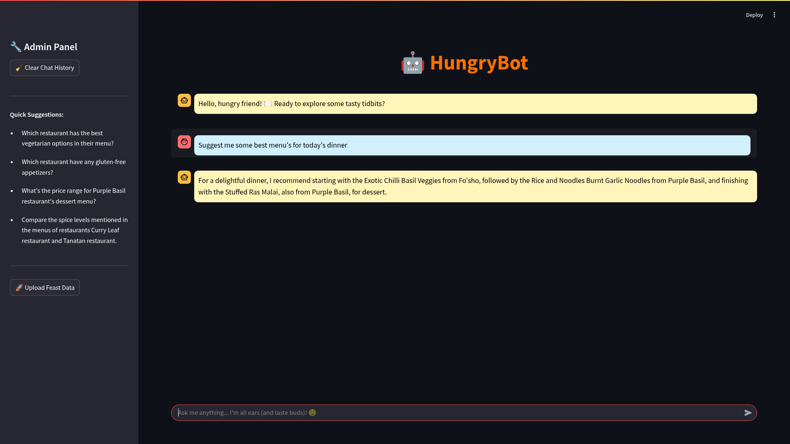

# Zomato Restaurant RAG Chatbot 🍽️

An intelligent restaurant recommendation system that combines web scraping, RAG (Retrieval Augmented Generation), and a conversational interface to provide personalized dining suggestions.

## 📸 Screenshots & Demo

### Demo Video
Check out our demo video to see the chatbot in action:
[Watch Demo Video](https://youtu.be/your-video-link)

### UI Screenshots

#### Main Chat Interface

*The main chat interface where users can interact with the chatbot*

#### Restaurant Recommendations

*Example of restaurant recommendations with detailed information*

#### Menu Exploration

*Detailed menu view with prices and categories*

#### Upload Data Interface

*Uploading new data*

## 🌟 Features

### Web Scraping
- Automated scraping of restaurant data from Zomato
- Extracts comprehensive restaurant information including:
  - Basic details (name, address, ratings)
  - Menu items with prices and categories
  - Dietary options (veg/non-veg)
  - Operating hours
  - Location data
  - Payment methods
  - Cuisine types

### Data Processing
- Intelligent menu categorization
- Price normalization and currency handling
- Smart duplicate detection and removal
- Structured data transformation for vector storage
- Dietary preference detection
- Address formatting and standardization

### RAG System
- Vector-based similarity search using Pinecone
- Hybrid search combining menu items and restaurant details
- Context-aware response generation
- Fallback handling for general queries
- Dynamic prompt generation based on query type

### Chat Interface
- Interactive Streamlit-based UI
- Real-time response generation
- Chat history maintenance
- Admin controls for data upload
- Loading state indicators
- Markdown formatting support

## 🛠️ Technology Stack

### Core Technologies
- Python 3.x
- MongoDB (with Motor for async operations)
- Pinecone Vector Database
- Google Gemini AI
- Streamlit

### Key Libraries
- FastAPI
- Playwright
- BeautifulSoup4
- Pydantic
- Motor (Async MongoDB)
- Google Generative AI
- Python-dotenv

## 📋 Requirements

```bash
pymongo              # MongoDB driver
pinecone-client      # Vector database client
python-dotenv        # Environment management
fastapi              # API framework
playwright           # Web automation
bs4                  # Web scraping
requests             # HTTP client
google-generativeai  # LLM integration
streamlit            # UI framework
motor                # Async MongoDB
uvicorn              # ASGI server
```

## 🚀 Getting Started

1. Clone the repository:
```bash
git clone <repository-url>
cd zomato-rag-chatbot
```

2. Create and activate virtual environment:
```bash
python -m venv venv
source venv/bin/activate  # On Windows: venv\Scripts\activate
```

3. Install dependencies:
```bash
pip install -r requirements.txt
```

4. Set up environment variables:
```bash
# Create .env file with:
MONGODB_URI=your_mongodb_uri
GEMINI_API_KEY=your_gemini_api_key
PINECONE_API_KEY=your_pinecone_api_key
```

5. Initialize the database:
```bash
python scraper/main.py  # Scrape initial data
python scraper/knowledge_base/build_kb.py  # Build knowledge base
```

6. Start the application:
```bash
cd rag
streamlit run main.py
```

## 🏗️ Project Structure

```
.
├── scraper/
│   ├── scrapers/
│   │   ├── info_scraper.py
│   │   └── menu_scraper.py
│   ├── knowledge_base/
│   │   └── build_kb.py
│   └── main.py
├── rag/
│   ├── db/
│   │   └── pine_utils.py
│   ├── models/
│   │   ├── restaurant.py
│   │   └── menu_item.py
│   ├── utils/
│   │   ├── generatePrompt.py
│   │   └── llm.py
│   └── main.py
└── requirements.txt
```

## 💡 Usage

1. **Data Collection**:
   - Add restaurant URLs to `scraper/main.py`
   - Run the scraper to collect data
   - Data is saved in JSON format

2. **Knowledge Base**:
   - Raw data is processed into a structured format
   - Vector embeddings are created for efficient retrieval

3. **Chat Interface**:
   - Access the Streamlit interface
   - Ask questions about restaurants
   - Get AI-powered recommendations

## 🤝 Contributing

1. Fork the repository
2. Create your feature branch (`git checkout -b feature/AmazingFeature`)
3. Commit your changes (`git commit -m 'Add some AmazingFeature'`)
4. Push to the branch (`git push origin feature/AmazingFeature`)
5. Open a Pull Request

## 📝 License

This project is licensed under the MIT License - see the LICENSE file for details